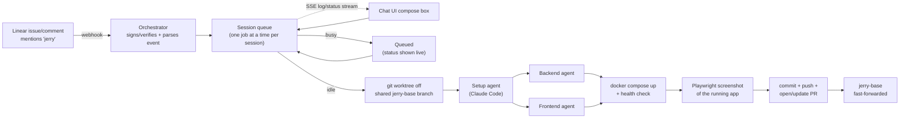

# linear-workflow-system

Tag a Linear issue with "jerry" and it gets picked up, worked on by Claude Code, run for real, screenshotted, and shipped as a PR — with a chat UI showing live status and logs.

## Workflow



## Pieces

- **`server.js`** — Express app: Linear webhook receiver (HMAC-verified), session REST API, SSE log stream, serves the chat UI.
- **`sessions.js`** — one queue per session (one Linear issue, or one chat) so concurrent messages queue instead of racing.
- **`pipeline.js`** — the actual workflow: git worktree → setup agent → backend + frontend agents in parallel → `docker compose up` → health check → screenshot → commit/push → PR.
- **`agents.js`** — spawns headless Claude Code (`claude -p ... --output-format stream-json`) sub-agents and streams their activity as log lines.
- **`public/`** — the chat UI: session list, live transcript, SSE-streamed logs, compose box.

## Trigger

Any Linear comment (or the initial issue title/description) containing the word "jerry" starts a session. No bot user/assignee needed — just a plain Linear webhook (Settings → Administration → API → Webhooks) subscribed to Comments + Issues.

## Setup

```bash
npm install
cp .env.example .env   # fill in LINEAR_API_KEY, LINEAR_WEBHOOK_SECRET, GITHUB_REPO_SSH
npm start               # listens on :3333
ngrok http 3333         # point the Linear webhook at <ngrok-url>/webhook/linear
```

Open `http://localhost:3333` for the chat UI.
