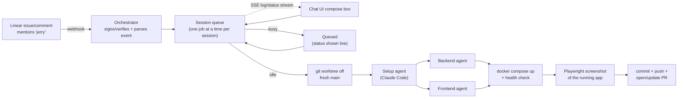

# Jerry — Linear-triggered Claude Code cloud agent

Tag a Linear issue (or just say the word "jerry" in a comment) and it gets picked up, worked on by a small fleet of Claude Code agents, run for real in Docker, screenshotted with a real browser, and shipped as a PR — with a live chat UI showing status and logs as it happens.

**Live:** [ai.rohhann.space](https://ai.rohhann.space) (UI) · [api.rohhann.space](https://api.rohhann.space) (API/webhook)

## Workflow



Every session gets its own git worktree branched fresh off `main` (not off another session's unmerged work), so each PR's diff stays scoped to just that change. Worktrees share one persistent local clone, so spinning up a new session doesn't mean re-cloning over the network.

## Stack

- **Backend**: Node/Express — session queue, Linear webhook receiver (HMAC-verified), REST API, SSE log stream
- **Frontend** (`web/`): React + Vite + Tailwind v4 + [shadcn/ui](https://ui.shadcn.com)
- **Agents**: headless Claude Code (`claude -p --output-format stream-json`), one per concern (setup / backend / frontend), run concurrently where safe
- **Verification**: real Docker Compose stack + Playwright screenshot of the running app, embedded directly in the PR

## Pieces

- **`server.js`** — Express app: Linear webhook receiver, session REST API, SSE log stream, serves the built UI
- **`sessions.js`** — one queue per session (one Linear issue, or one chat) so concurrent messages queue instead of racing
- **`pipeline.js`** — the actual workflow: git worktree → setup agent → backend + frontend agents in parallel → `docker compose up` → health check → screenshot → commit/push → PR
- **`agents.js`** — spawns and streams headless Claude Code sub-agents
- **`linear.js`** — comments the resulting PR link back onto the originating Linear issue
- **`web/`** — the chat UI: session list, live transcript, SSE-streamed logs, compose box, landing page

## Trigger

Any Linear comment (or the initial issue title/description) containing the word "jerry" starts a session — no bot user or assignee needed, just a plain Linear webhook (Settings → Administration → API → Webhooks) subscribed to Comments + Issues. The chat UI works identically and needs no Linear access at all.

## Setup

```bash
npm install
cp .env.example .env   # fill in LINEAR_API_KEY, LINEAR_WEBHOOK_SECRET, GITHUB_REPO_SSH
cd web && npm install && npm run build && cd ..
npm start               # listens on :3333, serving web/dist
```

Point your Linear webhook (or a local tunnel like ngrok during development) at `<your-url>/webhook/linear`.
